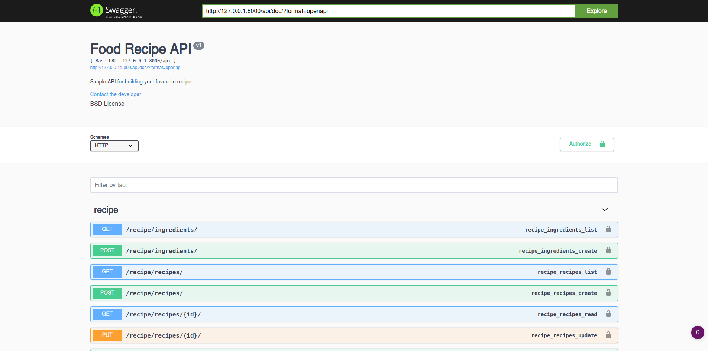

# Welcome to foody-recipe-app-api 👋



[](https://app.codacy.com/manual/dipto0321/foody-recipe-app-api?utm_source=github.com&utm_medium=referral&utm_content=dipto0321/foody-recipe-app-api&utm_campaign=Badge_Grade_Dashboard)
[](https://travis-ci.org/dipto0321/foody-recipe-app-api)
[](#)
[](LICENSE)
[](https://twitter.com/Diptokmk47)

> It's a foddy app api containes all the food recipe data

## Install
  - Install docker and docker-compose
  - Run this comman 👇
    ```sh
    docker build .
    docker-compose build
    ```

## Usage
  **Local**
  - First run 
    ```sh
    docker-compose up
    ```
  - Then goto `http://127.0.0.1:8000/api/doc/` for accessing API doc
  
  **Live**

  - [Live Doc](https://foody-recipe-app-api.herokuapp.com/api/doc/)
  - Browsable Apis
    - [User Create](https://foody-recipe-app-api.herokuapp.com/api/user/create/)
    - [User Login for getting token](https://foody-recipe-app-api.herokuapp.com/api/user/token/)
    - [User Profile (Authorization required)](https://foody-recipe-app-api.herokuapp.com/api/user/me/)
    - [Recipe View List (Authorization required)](https://foody-recipe-app-api.herokuapp.com/api/recipe/recipes/)
    - [Tag View List (Authorization required)](https://foody-recipe-app-api.herokuapp.com/api/recipe/tags/)
    - [Ingredients View List (Authorization required)](https://foody-recipe-app-api.herokuapp.com/api/recipe/ingredients/)
  
    [**Note:** Check live doc for detail information ☝️ ]

## Run tests

```sh
docker-compose run --rm app sh -c "python manage.py test && flake8"
```

## Author

👤 **Dipto Karmakar**

* Website: https://diptokarmakar.me/
* Twitter: [@Diptokmk47](https://twitter.com/Diptokmk47)
* Github: [@dipto0321](https://github.com/dipto0321)
* LinkedIn: [@diptokarmakar](https://linkedin.com/in/diptokarmakar)

## Show your support

Give a ⭐️ if this project helped you!


***
_This README was generated with ❤️ by [readme-md-generator](https://github.com/kefranabg/readme-md-generator)_
